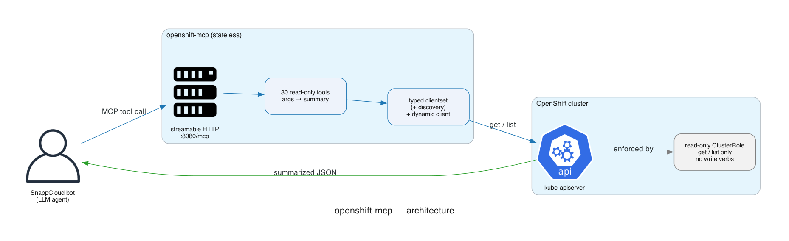

# openshift-mcp

Read-only OpenShift/Kubernetes observability MCP server. Gives an AI agent (the [SnappCloud bot](../snappcloud-bot)) cluster vision: pods, workloads, config, services, routes, network policies, events, container logs, quotas, storage, RBAC, nodes, live metrics, and cluster-level OpenShift health — summarized for LLM consumption. Built on the official [MCP Go SDK](https://github.com/modelcontextprotocol/go-sdk) (streamable-HTTP, stateless).

**Strictly read-only.** The ClusterRole grants only `get`/`list`; the server diagnoses issues and lets the agent recommend fixes — it never mutates cluster state.



## Tools (30)

Start with `diagnose_namespace` for open-ended questions; it returns ranked problems, each naming the tool to call next.

The list is capped at 30 — past that, overlapping descriptions measurably degrade tool selection. New capability folds into an existing tool unless it answers a genuinely different question. See [docs/design.md](docs/design.md).

### Triage

| Tool | Purpose |
|------|---------|
| `diagnose_namespace` | One-shot sweep: pods, workloads, endpoints, quota, PVCs → ranked problems + next step |

### Workloads & pods

| Tool | Purpose |
|------|---------|
| `list_pods` | Pods with phase/ready/restarts/node + failure reason |
| `get_pod` | One pod in depth: containers, states, conditions, resources, events |
| `pod_logs` | Container logs; `previous=true` for pre-crash logs |
| `list_events` | Namespace events (scheduling, image pull, OOM, probes) |
| `list_workloads` | Deployments/StatefulSets/DaemonSets/Jobs/CronJobs/DeploymentConfigs ready-vs-desired; optional `kinds` filter |
| `get_workload` | Rollout state, conditions, and the workload's pods (also job, cronjob, replicaset) |

### Config

| Tool | Purpose |
|------|---------|
| `list_config` | ConfigMap + Secret key names (**never secret values**) — the check for `CreateContainerConfigError` |

### Networking

| Tool | Purpose |
|------|---------|
| `list_services` / `get_service` | Services + endpoint readiness (selector mismatches) |
| `list_routes` | OpenShift Routes: host, target, TLS, admitted |
| `list_ingresses` | Ingress rules, TLS hosts, assigned address |
| `list_network_policies` | Target pods + ingress/egress rules; flags default-deny |

### Scaling, storage, RBAC

| Tool | Purpose |
|------|---------|
| `list_hpas` | Min/max, current vs desired, metric targets, blocking conditions |
| `list_pdbs` | Allowed disruptions (0 = drains blocked) |
| `list_pvcs` | PVC phase/capacity/class; adds StorageClasses + default-class warnings when any PVC is unbound |
| `get_quota` | ResourceQuota usage + LimitRanges |
| `list_rbac` | ServiceAccounts, Roles, RoleBindings (for 403s) |

### Cluster & nodes

| Tool | Purpose |
|------|---------|
| `list_namespaces` | Namespace discovery, phase, age |
| `list_nodes` | Node readiness, pressure, taints, capacity; `include_usage=true` adds live CPU/mem as % of allocatable |
| `get_node` | One node in depth |
| `top_pods` | Live CPU/memory per pod |
| `api_resources` | Discover exact group/version/resource for the generic tools |

### OpenShift

| Tool | Purpose |
|------|---------|
| `list_cluster_operators` | Available/Degraded/Progressing + failure message |
| `get_cluster_version` | Version, channel, upgrade progress, history |
| `list_machines` | Machine phase and backing node |
| `list_builds` | Build phase, reason, failure message |
| `list_imagestreams` | Tags; flags tags resolving to no image |

### Escape hatch

| Tool | Purpose |
|------|---------|
| `get_resource` / `list_resource` | Generic read for any CRD/OpenShift kind (within RBAC) |

Most tools take a required `namespace` — which lets the bot's authorization layer enforce the caller's scope on both arguments and results. The cluster-scoped exceptions are `list_nodes`, `get_node`, `list_namespaces`, `api_resources`, `list_cluster_operators`, `get_cluster_version`, `list_machines`, and the generic `get_resource` / `list_resource`.

`list_config` returns key names only. Secret values are never read into the response, regardless of what the ClusterRole permits.

### RBAC for the added tools

The tools added beyond the original 16 need `get`/`list` on these additional groups. Where RBAC is missing, tools degrade individually — `list_workloads` emits a warning rather than failing, and `diagnose_namespace` reports a skipped check — so this can be rolled out incrementally.

| Group | Resources |
|-------|-----------|
| `""` (core) | `configmaps`, `secrets`, `serviceaccounts`, `namespaces` |
| `batch` | `jobs`, `cronjobs` |
| `networking.k8s.io` | `networkpolicies`, `ingresses` |
| `autoscaling` | `horizontalpodautoscalers` |
| `policy` | `poddisruptionbudgets` |
| `storage.k8s.io` | `storageclasses` |
| `rbac.authorization.k8s.io` | `roles`, `rolebindings` |
| `apps` | `replicasets` |
| `config.openshift.io` | `clusteroperators`, `clusterversions` |
| `build.openshift.io` | `builds` |
| `image.openshift.io` | `imagestreams` |
| `apps.openshift.io` | `deploymentconfigs` |
| `machine.openshift.io` | `machines` |
| `metrics.k8s.io` | `nodes` |

## Docs

- [docs/design.md](docs/design.md) — the tool-budget rule and why each tool exists
- [docs/tools.md](docs/tools.md) — full per-tool reference
- [docs/diagrams/](docs/diagrams/) — architecture and flow diagrams

## Run

```bash
make run-http                 # streamable HTTP on :8080/mcp
make run-mcp                  # stdio (local MCP clients)
K8S_KUBECONFIG=~/.kube/config make run-http   # outside a cluster
```

Env: `K8S_KUBECONFIG`, `K8S_CONTEXT`, `K8S_TIMEOUT` (30s), `K8S_QPS` (50), `K8S_BURST` (100). In-cluster it uses the ServiceAccount.

## Deploy

The Helm chart lives in the ArgoCD apps repo at `core/helm/apps/openshift-mcp` (Deployment, Service, ServiceAccount, read-only ClusterRole/Binding, private HTTPProxy at `openshift-mcp.apps.private.<region_hostname>/mcp`, NetworkPolicy restricted to the ingress namespace) and is registered in `newcluster-bootstrap`. Add each deployed region to the bot's `agent.clusters[].servers` as `- name: k8s`. Extra CRDs can be exposed through `get_resource`/`list_resource` via read-only rules in `rbac.extraRules`.
