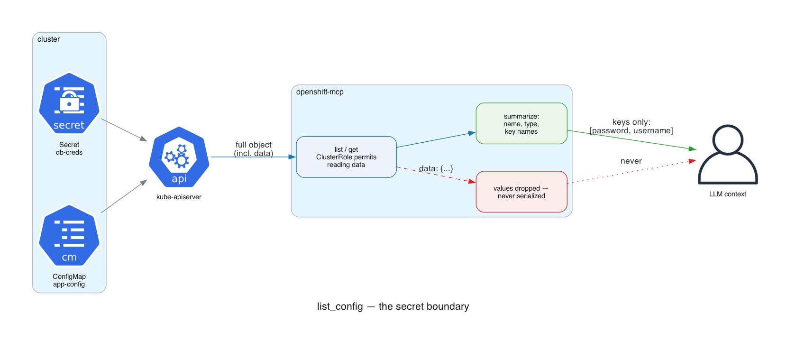
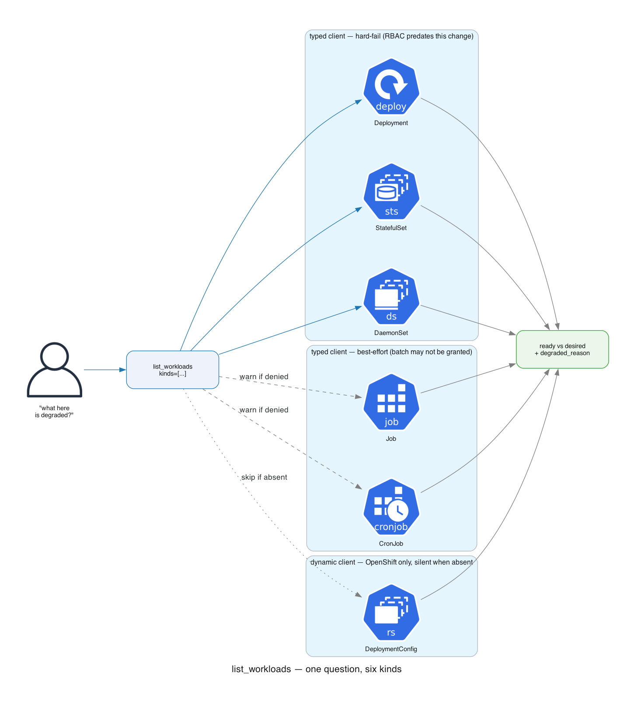

# Design

Why this server has the tools it has, and the rules for adding more.

## What this server is for

An LLM agent diagnosing a cluster it cannot change. Every tool exists to answer a question a human would otherwise answer with `kubectl` plus experience — and crucially, to answer it in a form that fits in a context window. Raw objects are not the product; **summaries that name the fault are**.

That framing drives every rule below.

## The two hard constraints

### 1. Strictly read-only

The ClusterRole grants only `get` and `list`. No tool uses a write verb, and no tool is permitted to. The server explains what is wrong and recommends a fix; a human applies it.

This rules out otherwise-obvious features. A definitive "can this pod do X?" answer needs `SubjectAccessReview`, which is a **create** verb — so `list_rbac` describes bindings instead and says so in its output rather than implying a complete answer.

### 2. Secret values never reach the model

`list_config` returns Secret names, types, and **key names only**. The ClusterRole may permit reading `data`, and the API server hands it over — the server drops it before serialization.

The diagnostic question ("does the key the pod references exist?") is fully answered by key names. Values would add nothing but risk: anything in a response is in the model's context, and may be logged or echoed downstream. This is enforced by a test that asserts no plaintext **or base64** form of a value appears in the output.

## The tool budget: 30

The list is capped at 30, pinned by a test.

The cost of a long tool list is not the count itself — it is **ambiguity between overlapping tools**. Two tools that could each plausibly answer one question is what degrades selection accuracy. Thirty distinct questions is fine; ten overlapping ones are not.

So, the rule:

> **Add a tool when it answers a different question. Fold when it is the same question over a different kind.**

### The sharper filter

`list_resource` already reaches *every* resource in the cluster, including any CRD — but it returns only name, namespace, and age. So the test for a new tool is not "can we reach this object?" (we always can) but:

> **Does this object's status need real summarizing?**

An HPA's `ScalingLimited` condition, a NetworkPolicy's empty-rules-means-deny, a ClusterOperator's degraded message — the generic path technically reaches all of them and tells you nothing useful. That is what earns a tool name.

A resource whose useful content is "it exists" does not need one.

### The rule in practice

Jobs, CronJobs, and DeploymentConfigs all answer list_workloads' question — "what here is degraded?" — so they are `kinds`, not tools:

Other applications of the same rule:

| Capability | Decision | Why |
|---|---|---|
| ConfigMaps + Secrets | one tool, `list_config` | One question: "does the referenced config exist?" Two tools would mean two calls to answer it. |
| Jobs / CronJobs / DeploymentConfigs | `kinds` in `list_workloads` | Same "what is degraded?" question. |
| ReplicaSets | `kind` in `get_workload` | Same "what is this workload's state?" question. |
| StorageClasses | attached to `list_pvcs` when a PVC is unbound | Only explains anything when something is not binding — which is exactly `list_pvcs`' question. |
| Node usage | `list_nodes include_usage=true` | Same "is the node layer healthy?" question. Opt-in because it costs a second API call and needs `metrics.k8s.io`. |
| OLM ClusterServiceVersions | no tool | Real, but rare in a team-scoped namespace. Reachable via `get_resource`. First thing to add if the budget grows. |

## Degradation: a missing permission must not blind the tool

This server is deployed to clusters whose ClusterRoles predate the tools that need them. A tool that hard-fails on a resource its RBAC never granted would break clusters that work today. So:

- **`list_workloads`** hard-fails only on the original three kinds. Jobs and CronJobs are best-effort — a denial becomes a `warnings` entry. DeploymentConfigs are silent when absent, since a plain Kubernetes cluster has no such API and that is not a fault.
- **`diagnose_namespace`** treats every check but pods as best-effort. A denied check becomes a `skipped_checks` note.
- **`list_config`** returns whichever half is readable.
- **`list_nodes include_usage=true`** still lists nodes when metrics are down.

Every one of these says so in its output. A skipped check is reported, never silently omitted — **"I could not look" must never render as "nothing is wrong."** The server instructions tell the model to surface that distinction too.

## Output is for a model, not a terminal

- **Only the failing condition's message.** Healthy conditions are noise; a degraded ClusterOperator's message is the whole diagnosis.
- **Findings carry their next step.** `diagnose_namespace` returns the tool to call next, so the agent moves instead of re-listing.
- **State the non-obvious.** `WaitForFirstConsumer` PVCs stay Pending *by design* — unlabelled, that reads as a bug. A `0 disruptions allowed` PDB is labelled as the thing blocking a drain.
- **No HTML escaping.** The model reads the JSON verbatim, so `web -> svc:8080` must not arrive as `web -> svc:8080`. Rendering goes through `renderJSON`, not `json.MarshalIndent`.

## Compatibility

Tool names are an API — the bot's prompts and its authorization layer reference them. The original 16 names are pinned by a test.

Changes are additive only: no renames, no removals, no optional parameter becoming required, no change to an existing result's meaning. `list_workloads` with only a namespace behaves as it always did, plus the new kinds.

## Authorization

Most tools require `namespace`, which is what lets the bot's authorization layer enforce the caller's scope on both arguments and results. A namespaced tool that allowed the argument to be omitted would read across namespaces unchecked — so a test asserts every tool requires it except the deliberately cluster-scoped ones.

## Layout

| File | Contents |
|---|---|
| `internal/mcp/tools.go` | Tool registry: names, descriptions, JSON schemas |
| `internal/mcp/server.go` | MCP wiring, arg decoding, JSON rendering, agent instructions |
| `internal/mcp/handlers.go` | Pods, events, workloads, services, routes, storage, quota, nodes, generic |
| `internal/mcp/handlers_config.go` | `list_config` and the secret boundary |
| `internal/mcp/handlers_network.go` | NetworkPolicies, Ingresses |
| `internal/mcp/handlers_scaling.go` | HPAs, PDBs |
| `internal/mcp/handlers_batch.go` | Jobs, CronJobs, ReplicaSets |
| `internal/mcp/handlers_storage.go` | StorageClasses (folded into `list_pvcs`) |
| `internal/mcp/handlers_rbac.go` | ServiceAccounts, Roles, RoleBindings |
| `internal/mcp/handlers_cluster.go` | Namespaces, API discovery, node usage |
| `internal/mcp/handlers_openshift.go` | ClusterOperators, ClusterVersion, Builds, ImageStreams, Machines, DeploymentConfigs |
| `internal/mcp/handlers_diagnose.go` | `diagnose_namespace` |

Handlers are split by domain rather than piled into one file — `handlers.go` was already 782 lines before this work, and the new tools would have pushed it past 1400.
