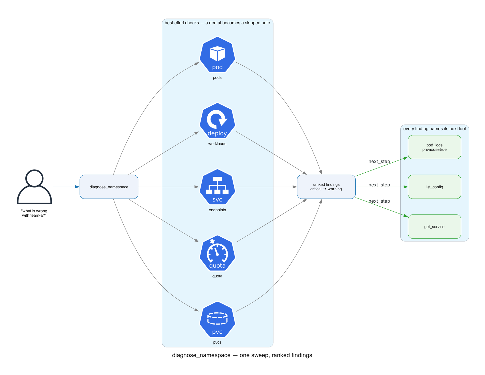
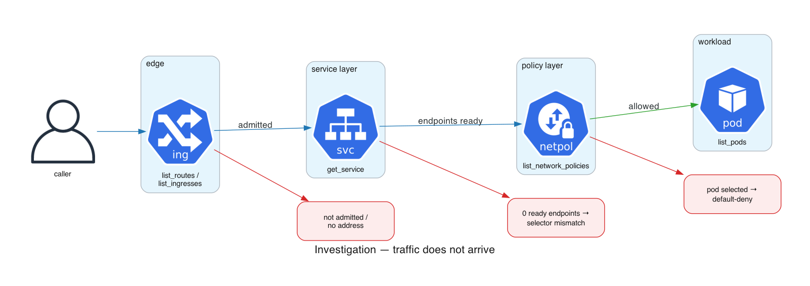
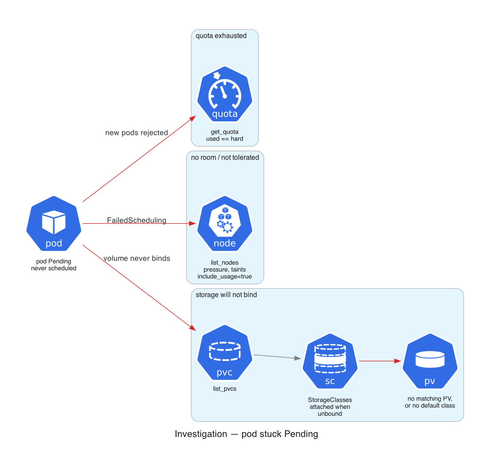

# Tool reference

All 30 tools, what they answer, and their arguments. Every tool is read-only.

`namespace` is required unless the tool is marked **cluster-scoped**.

- [Triage](#triage)
- [Workloads & pods](#workloads--pods)
- [Config](#config)
- [Networking](#networking)
- [Scaling, storage, quota, RBAC](#scaling-storage-quota-rbac)
- [Cluster & nodes](#cluster--nodes)
- [OpenShift](#openshift)
- [Escape hatch](#escape-hatch)

---

## Triage

### `diagnose_namespace`

One sweep across pods, workloads, service endpoints, quota, and PVCs. Returns **only problems**, ranked worst-first, each with the tool to call next.

| Arg | Type | Notes |
|---|---|---|
| `namespace` | string | required |

Findings are `critical` (nothing is serving) or `warning` (degraded/at risk). Detected: Pending pods, CrashLoopBackOff, ImagePullBackOff, CreateContainerConfigError, OOMKilled (from last state, invisible once the container restarts), degraded Deployments, services with 0 ready endpoints, exhausted quota, unbound PVCs.

Every check except pods is best-effort. A denied check appears in `skipped_checks` — **their absence is not a clean bill of health.** Headless and ExternalName services are not flagged; they legitimately have no endpoints.

---

## Workloads & pods

### `list_pods`
Pods with phase, ready count, restarts, node, and a reason when unhealthy.

| Arg | Type | Notes |
|---|---|---|
| `namespace` | string | required |
| `selector` | string | label selector, e.g. `app=web` |
| `field_selector` | string | e.g. `status.phase=Pending` |
| `limit` | integer | default 100, max 500 |

### `get_pod`
One pod in depth: containers (image, state, restart reason, resources), conditions, QoS, and recent events. Takes `namespace`, `name`.

### `pod_logs`
Container logs. **`previous=true` is essential for CrashLoopBackOff** — it reads the pre-crash instance. Capped at 64 KiB (tail kept).

| Arg | Type | Notes |
|---|---|---|
| `namespace`, `name` | string | required |
| `container` | string | defaults to the first |
| `tail_lines` | integer | default 100, max 2000 |
| `previous` | boolean | logs from before the last restart |

### `list_events`
Namespace events: scheduling failures, image pull errors, OOM kills, probe failures. Takes `namespace`, optional `object`, `warnings_only`.

> Events expire (~1h). Their absence does not mean absence of problems.

### `list_workloads`
Deployments, StatefulSets, DaemonSets, Jobs, CronJobs, and OpenShift DeploymentConfigs with ready-vs-desired and a `degraded_reason`.

| Arg | Type | Notes |
|---|---|---|
| `namespace` | string | required |
| `kinds` | string[] | `deployment`, `statefulset`, `daemonset`, `job`, `cronjob`, `deploymentconfig`. Default: all |

Jobs/CronJobs are best-effort (a `batch` RBAC denial becomes a warning); DeploymentConfigs are silent when the API is absent. See [design.md](design.md#degradation-a-missing-permission-must-not-blind-the-tool).

### `get_workload`
One workload's state: replica or completion counts, conditions with messages, selector, and its pods.

| Arg | Type | Notes |
|---|---|---|
| `namespace`, `name` | string | required |
| `kind` | enum | `deployment`, `statefulset`, `daemonset`, `job`, `cronjob`, `replicaset` |

A CronJob has no pods of its own — it returns its active **Job** names; follow up with `kind=job`.

---

## Config

### `list_config`
ConfigMaps and Secrets with their **key names**. The check for `CreateContainerConfigError`, where a pod references a missing object or key.

| Arg | Type | Notes |
|---|---|---|
| `namespace` | string | required |
| `selector` | string | label selector |

> **Secret values are never returned** — see [the secret boundary](design.md#2-secret-values-never-reach-the-model). ConfigMap values are available via `get_resource`.

Each half is best-effort: RBAC commonly grants configmaps but not secrets.

---

## Networking

### `list_services` / `get_service`
Services with type, cluster IP, ports, and ready endpoint counts. **0 ready endpoints = selector mismatch or unready pods.** `get_service` adds per-endpoint addresses and readiness.

### `list_routes`
OpenShift Routes: host, target service, TLS termination, admitted status. An unadmitted Route was never claimed by a router.

### `list_ingresses`
Kubernetes Ingresses: host/path rules, backends, TLS hosts, assigned addresses. **No address = no controller claimed it** (check the class). On OpenShift, `list_routes` is usually the relevant tool.

### `list_network_policies`
Each policy's target pods and its rules in readable form (`allow from pods(app=gateway) on 8080/TCP`).

The thing to check when endpoints are ready but traffic still fails:

- A pod selected by **any** policy is default-deny for that policy's types.
- Enforced with no rules → `DENY ALL`.
- **No policies at all → everything is allowed.**

---

## Scaling, storage, quota, RBAC

### `list_hpas`
Min/max, current vs desired replicas, each metric target paired with its current value, and conditions that block scaling.

Explains "I scaled it and it scaled back" (an HPA owns the replica count) and "it never scales up" (`ScalingActive=False` / `FailedGetResourceMetric` — the metrics pipeline is broken). `at_max: true` means it is pinned at the ceiling.

### `list_pdbs`
Allowed disruptions and healthy/desired counts. **`disruptions_allowed: 0` is why a node drain or upgrade hangs forever.**

### `list_pvcs`
PVC phase (Pending = unbound), capacity, storage class, bound volume.

When **any** PVC is unbound it also returns the cluster's StorageClasses and flags the binding blockers: no default class (a PVC omitting `storageClassName` waits forever), or two defaults (Kubernetes cannot pick). `WaitForFirstConsumer` is called out as expected-not-a-fault.

### `get_quota`
ResourceQuota used-vs-hard and LimitRanges. **Exhausted quota silently rejects new pods and stalls rollouts.**

### `list_rbac`
ServiceAccounts, Roles, and RoleBindings — for a pod getting 403 from the API.

This **describes bindings; it does not decide access**. A ClusterRoleBinding may grant more than is shown, and a definitive check needs `SubjectAccessReview` — a create verb this read-only server cannot use. The output says so.

---

## Cluster & nodes

### `list_namespaces` — cluster-scoped
Namespaces with phase and age. Optional `filter` (substring), `selector`. Flags namespaces stuck `Terminating` (usually a finalizer).

### `list_nodes` — cluster-scoped
Readiness, roles, kubelet version, allocatable CPU/memory, taints, pressure.

| Arg | Type | Notes |
|---|---|---|
| `include_usage` | boolean | adds live CPU/memory as a **percentage of allocatable** |

Usage is opt-in: it costs a second API call and needs `metrics.k8s.io`. If metrics are unavailable the nodes still list, with a `usage_warning`. The percentage is omitted rather than guessed when allocatable is unknown.

### `get_node` — cluster-scoped
One node: all conditions, taints, capacity vs allocatable, addresses, system info.

### `top_pods`
Live CPU (millicores) and memory (Mi) per pod, sorted by CPU. Compare against requests/limits from `get_pod`.

### `api_resources` — cluster-scoped
Discovers which resources the cluster serves, with the **exact group/version/resource** that `get_resource` / `list_resource` need.

| Arg | Type | Notes |
|---|---|---|
| `filter` | string | substring on resource, kind, or group (e.g. `cilium`) |
| `group` | string | exact group, e.g. `route.openshift.io` |

Call this instead of guessing GVR strings. Subresources and non-readable resources are omitted. An unreachable aggregated API becomes a `warning`, not a failure — partial discovery beats none.

---

## OpenShift

### `list_cluster_operators` — cluster-scoped
Available/Degraded/Progressing per operator, plus the message from any failing condition. `unhealthy_only=true` filters to the broken ones.

> **When many namespaces break at once, check here before blaming a workload.**

### `get_cluster_version` — cluster-scoped
Version, channel, upgrade progress, available updates, recent history.

### `list_machines` — cluster-scoped
Machine phase and backing node. Explains a node that never joined or vanished — which `list_nodes` cannot show, because a failed Machine has no node at all. `Running` with no `nodeRef` means the kubelet never registered.

### `list_builds`
Build phase, strategy, reason, failure message. **A failed build means the image was never produced** — the pod's ImagePullBackOff is a symptom, not the cause. Build logs: `pod_logs` with name `<build-name>-build`.

### `list_imagestreams`
Tags and the image repository. Flags `unresolved_tags` — tags resolving to no image, so pods referencing them cannot pull.

---

## Escape hatch

### `get_resource` / `list_resource`
Generic read for any resource, including any CRD, within RBAC. Use `api_resources` to find the exact values.

| Arg | Notes |
|---|---|
| `group` | `""` for core, e.g. `route.openshift.io` |
| `version` | e.g. `v1` |
| `resource` | plural, e.g. `routes` |
| `namespace` | omit for cluster-scoped |
| `name` | `get_resource` only |
| `selector` | `list_resource` only |

`get_resource` returns the full object minus `managedFields` and the last-applied annotation. **`list_resource` returns only name/namespace/age**, capped at 50 — which is why objects whose status matters have their own tool.
